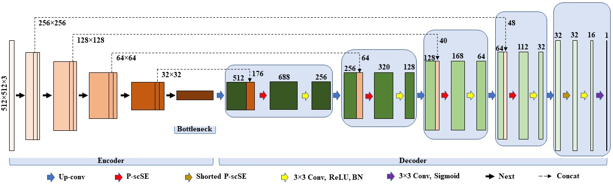
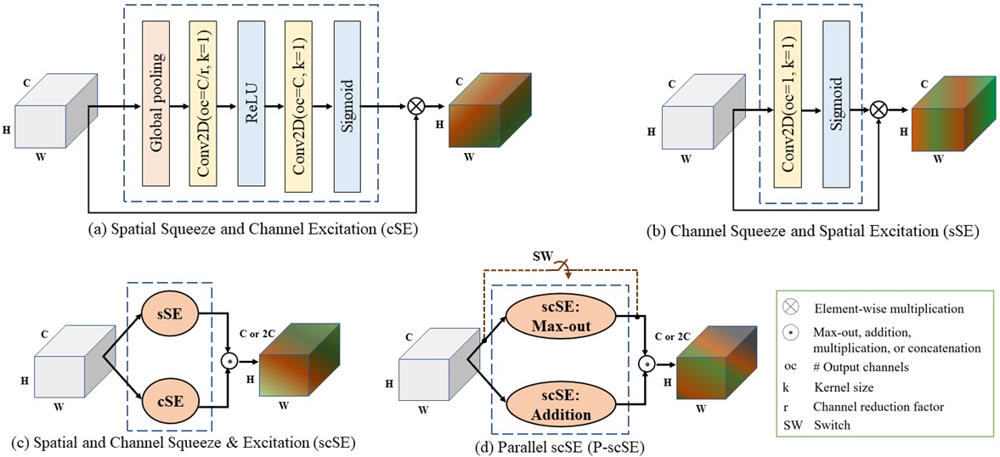

# FUSegNet

## Description will be added soon

FUSegNet and x-FUSegNet are implemented on top of [qubvel's](https://github.com/qubvel/segmentation_models.pytorch) implementation.  

**Preprint** [link](https://arxiv.org/abs/2305.02961).

## Saved models
Our saved (trained) models can be downloaded from the following links-
* [FUSegNet](https://drive.google.com/drive/folders/14HFRiNdeN10NPx7S6Lts4ymidNpjibI2?usp=sharing) trained on Chronic Wound dataset
* [xFUSegNet](https://drive.google.com/drive/folders/18696pUMWWdIOAgOLcXR_hut0ukKPXuV9?usp=sharing) trained on MICCAI FUSeg Challenge 2021 dataset

## Code description

* utils <br>
	|--`category.py`: Lists AZH Chronic wound test imgaes into 10 categories. Categories are created based on %GT area in images. Categorized test image names 	   are stored in a json file called [categorized_oldDfu.json](https://github.com/mrinal054/FUSegNet/blob/main/categorized_oldDfu.json) <br>
	|--`eval.py`: Performs data-based evaluation.<br>
	|--`eval_categorically.py`: Performs data-based evaluation for each category.<br>
	|--`eval_boxplot.py`: Performs image-based evaluation for each category that is required for boxplot. The final output is 
	an excel file with multiple sheets. Each sheet stores results for a perticular category.<br>
	|--`boxplot.py`: Creates a boxplot. It utilizes the excel file generated by `eval_boxplot.py`.<br>
	|--`contour.py`: Draws contours around the wound region.<br>
	|--`runtime_patch.py`: Creates patch during runtime. <br>
* `fusegnet_all.py`: It's an end-to-end file contains codes for dataloader, training and testing using the FUSegNet model.
* `fusegnet_train.py`: It is to train a dataset using the FUSegNet model.
* `fusegnet_test.py`: It is to perform inference using the FUSegNet model.
* `xfusegnet_all.py`: It's an end-to-end file contains codes for dataloader, training and testing using the xFUSegNet model.
* `xfusegnet_train.py`: It is to train a dataset using the xFUSegNet model.
* `xfusegnet_test.py`: It is to perform inference using the xFUSegNet model.
* `FUSegNet_feature_visualization.ipynb`: Demonstrates intermediate features.

## Network architecture
**Proposed FUSegNet overview:**

<br>
<br>
**Proposed parallel scSE (P-scSE) module:**



## Directory setup
The directory structure is shown below. Note that if checkpoints, plots, and predictions folders are not created beforehand, they will be generated automatically. 
```
.
|-- fusegnet_all.py
|-- fusegnet_train.py
|-- fusegnet_test.py
|-- xfusegnet_all.py
|-- xfusegnet_train.py
|-- xfusegnet_test.py
|-- utils
|-- dataset
	|-- train
		|-- images
			|-- (training and validation images are kept here)
		|-- labels 
			|-- (training and validation labels are kept here)
	|-- test
		|-- images 
			|-- (test images are kept here)
		|-- labels 
			|-- (test labels are kept here)
|-- checkpoints
	|-- (models will be stored here)
|-- plots
	|-- (loss curves will be stored here)
|-- predictions
	|-- (model predictions will be store here)
```


## Parameters setup
`fusegnet-all.py`, `fusegnet-train.py`, `xfusegnet-all.py`, and `xfusegnet-train.py` have a section called `Parameters` where the user can set the model parameters. The following are the model parameters used to train `FUSegNet` and `xFUSegNet`.  
```python
BASE_MODEL = 'FuSegNet' # give any name for the model
ENCODER = 'efficientnet-b7' # encoder model 
ENCODER_WEIGHTS = 'imagenet' # encoder weights
BATCH_SIZE = 2 # no. of batches
IMAGE_SIZE = 224 # height and width
n_classes = 1 # no. of classes excluding background
ACTIVATION = 'sigmoid' # output activation. sigmoid for binary and softmax for multi-class segmentation
DEVICE = torch.device("cuda" if torch.cuda.is_available() else "cpu") # sets gpu if available
LR = 0.0001 # learning rate
EPOCHS = 200 # no. of epochs
WEIGHT_DECAY = 1e-5 # for L2 penalty
SAVE_WEIGHTS_ONLY = True # if True, saves weights only
TO_CATEGORICAL = False # if True, converts to onehot
SAVE_BEST_MODEL = True # if True, saves the best model only
SAVE_LAST_MODEL = False # if True, saves the model after completing the training
PERIOD = None # periodically save checkpoints
RAW_PREDICTION = False # if true, then stores raw predictions (i.e. before applying threshold)
PATIENCE = 30 # no. of epoches waits before early stopping
EARLY_STOP = True # if True, enables early stopping
```

## How to use
**Mode: end-to-end**
* In this mode, training and inference codes are embedded in a single .py file. *
* `fusegnet_all.py` and `xfusegnet_all.py` files are written in this mode. 
* Once the model parameters are set in the `Parameter` section, the user can run (train, validation, and test)  using the following commands - `python fusegnet_all.py` or `python xfusegnet_all.py`.
* `fusegnet_all.py` and `xfusegnet_all.py` can directly be run from any IDE (e.g. Spyder, PyCharm, Jupyter Notebook, etc.)

**Mode: train only**
* In this mode, only training code is embedded in the .py file.
* `fusegnet_train.py` and `xfusegnet_train.py` work in this mode.
* Once the model parameters are set in the `Parameter` section, the user can train the model using the following commands - `python fusegnet_train.py` or `python xfusegnet_train.py`.
* `fusegnet_train.py` and `xfusegnet_train.py` can directly be run from any IDE (e.g. Spyder, PyCharm, Jupyter Notebook, etc.)

**Mode: test (inference) only**
* In this mode, only inference code is embedded in the .py file.
* `fusegnet_test.py` and `xfusegnet_test.py` work in this mode.
* The user can test the model using the following commands - `python fusegnet_test.py` or `python xfusegnet_test.py`.
* `fusegnet_train.py` and `xfusegnet_train.py` can directly be run from any IDE (e.g. Spyder, PyCharm, Jupyter Notebook, etc.).
* To test with our saved models, put the saved models in the `checkpoints` directory and then perform either one of the above two steps.

**Mode: feature visualization**
* In this mode, intermediate feature maps are visualized. 
* `FUSegNet_feature_visualization.ipynb` demonstrates the output feature maps of the parallel scSE (P-scSE) modules and each decoder stage.

## Results

## Reference
